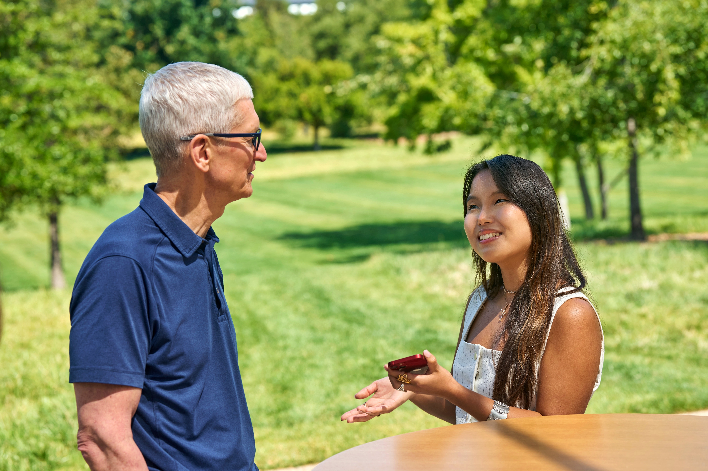

# Distinguished Winner of Apple Swift Student Challenge 2025: Yume’s Spellbook

In 2025, Larissa was selected as one of 50 worldwide Distinguished Winners in the Apple Swift Student Challenge for her innovative iOS app *Yume’s Spellbook*. This recognition granted her the opportunity to attend WWDC 2025 in Cupertino.

## Project Overview

*Yume’s Spellbook* offers an intuitive and engaging experience where users assist Yume, a friendly wizard, in crafting magical spells. Through this metaphor, players collect ingredients such as “magical power” (computation), “raw texts” (training data), and “cooking rules” (hyperparameters) to fine-tune a GPT-2 language model.

The app gamifies complex concepts behind large language models, fostering understanding and transparency without requiring technical expertise. It builds on Larissa’s previous project, *Yume The Wizard* (Swift Student Challenge 2024), which focused on fairness and interpretability in AI models.

## Key Features and Motivations

- **Interactive Storytelling:** A captivating narrative guides users through the process of training and fine-tuning language models in a playful, accessible way.
- **Core ML Integration:** The app runs a Core ML–optimized GPT-2 model on device, enabling secure and efficient real-time sentence completion.
- **Model Optimization:** Advanced techniques like pruning, palettization, and 8-bit quantization were used to compress the original 250 MB GPT-2 model to fit Apple’s 25 MB size limit, balancing performance and file size constraints.
- **Educational Impact:** By revealing the inner workings of LLMs, the app empowers users to approach AI with a critical and informed perspective.

### Technologies Used

- **Swift and SwiftUI:** For building a visually rich, responsive user interface and seamless narrative flow with smooth animations.
- **Core ML:** To deploy the GPT-2 model on device, ensuring privacy and fast inference.
- **PyTorch & coremltools:** Used in training and converting the model from PyTorch to Core ML format.
- **swift-coreml-transformers:** Hugging Face’s toolkit for integrating transformer models efficiently on iOS.
- **AVFoundation:** For sound effects that enhance immersion.
- **Custom Artwork:** All drawings, characters, and illustrations were created by Larissa.

## Screenshots

## Impact and Recognition

Larissa’s project was honored with a Distinguished Winner Award in the 2025 Apple Swift Student Challenge, recognizing her innovation, creativity, and commitment to demystifying large language models (LLMs). She was featured in the official [Apple Newsroom Article](https://www.apple.com/br/newsroom/2025/05/brazils-swift-student-challenge-winners-share-their-passions-with-the-world/) highlighting the eight Brazilian Distinguished Winners who are shaping the future of inclusive and impactful technology.

As part of the award, she was invited to Apple Park in Cupertino for an exclusive three-day WWDC experience, where she had the opportunity to attend live sessions, meet Apple engineers, and personally present Yume’s Spellbook to Apple CEO Tim Cook.

You can explore Yume’s Spellbook on the [App Store](https://apps.apple.com/de/app/yumes-spellbook/id6741521708?l=en-GB) and learn more about it in her [GitHub repository](https://github.com/lariokabayashi/YumeSpeelbook).